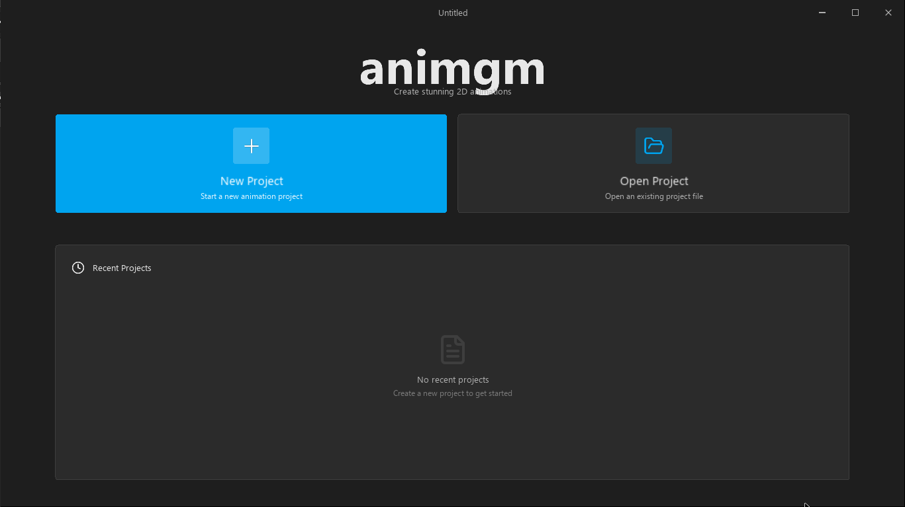
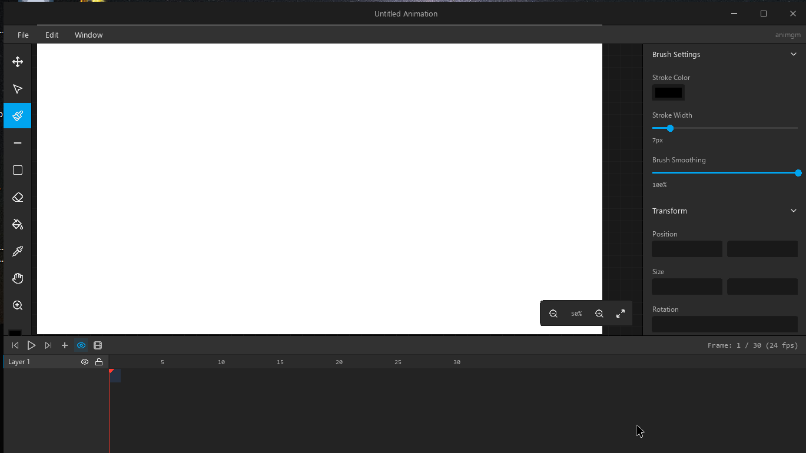
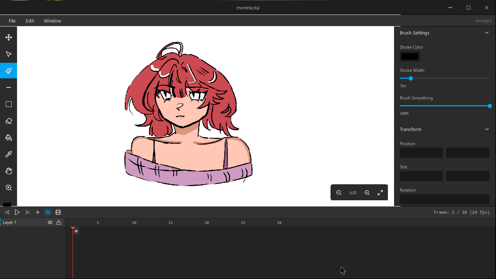

# animgm

A 2D frame-by-frame animation program built in **GameMaker**

## Screenshots

| Project Manager | Canvas | Drawing |
| --- | --- | --- |
|  |  |  |

## Features

- **Project Manager** - welcome screen with recent projects, thumbnails, and a
  New Project dialog with resolution/format presets (1080p, 4K, Square, Story…).
- **Drawing tools** - brush (with a Photoshop-style stroke stabilizer and
  anti-aliased edges), line, shapes (rect/ellipse/polygon/star…), eraser,
  paint bucket (flood fill), eyedropper, hand, zoom.
- **Selection & transform** - rectangular marquee with move / resize / rotate
  handles, plus editable X/Y/W/H/Rotation fields in the properties panel.
  Cut / Copy / Paste / Delete.
- **Timeline** - layers, keyframes (Flash-style spans), playback, onion skin,
  scrubbing, adjustable frame count and FPS.
- **Layers** — add / duplicate / reorder / rename / delete (right-click menu),
  visibility, lock, per-layer opacity.
- **Custom window chrome** - borderless window with a custom title bar
  (minimize / maximize / close), smooth maximize animation, and an
  unsaved-changes guard on close / open / new.
- **Image import** - via File → Import or (WIP) drag-and-drop; each image lands
  on its own new layer.
- **Save / Load** - compact binary `.anst` format (deflate-compressed raster
  frames, cropped to their bounding box).
- **MP4 export**
- **Audio track** — import a `.wav`, `.ogg`, or `.mp3,
  drag it along the timeline to reposition/trim it, played back in sync
  while scrubbing/playing in the editor..

## File format (`.anst`)

Binary. Header then project metadata, layers, and
per-keyframe raster blobs. Frames are stored as the deflate-compressed ARGB

## Planned

- **Export to more formats** - PNG sequence, GIF, WebM (currently MP4 only).
- **Audio in MP4 export** + the editor imports/plays audio already; muxing it
  into the exported MP4 as raw PCM is not done yet.
- **Auto-select** - select a region by colour similarity, not
  just the rectangular marquee.
- **Skeletal animation (Work in progress)** - bones, hierarchy, and pixel-to-bone binding as an